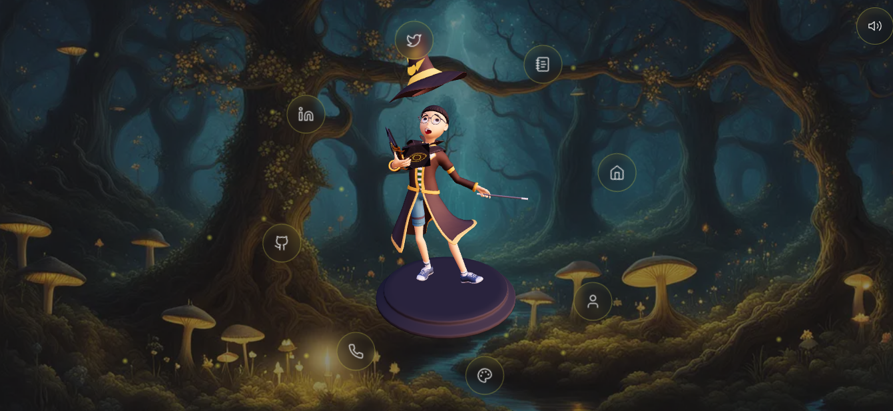
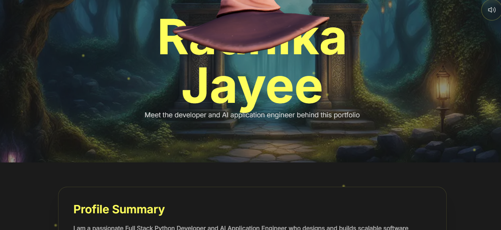
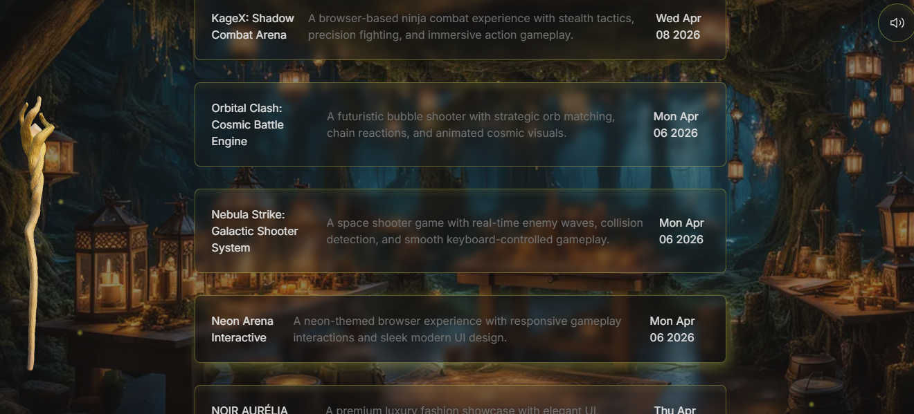
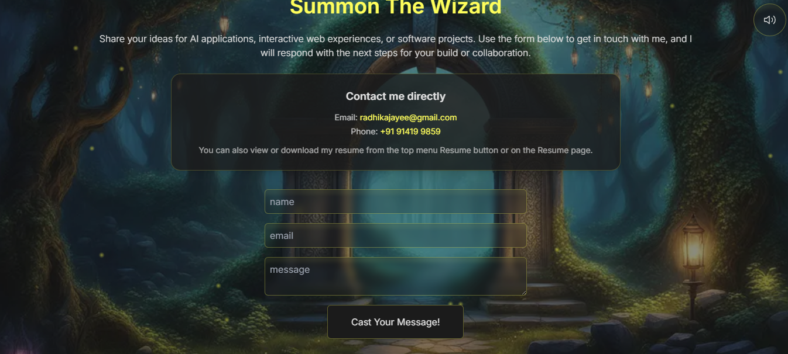

# 🚀 Radhika Jayee | Creative Developer Portfolio


This repository contains the source code for my **personal creative portfolio website**, built to showcase my projects, technical skills, certifications, achievements, and developer journey.

🌐 Live Demo:
👉 https://radhika-portfolio-orcin.vercel.app/

---

## ✨ About This Portfolio

My portfolio is designed to reflect:

* My professional developer identity
* Featured projects and case studies
* Technical stack and coding skills
* Resume and certifications
* Contact and social links

This website highlights both creativity and technical expertise with a clean, modern UI.

---

## 🔥 Features

✔ Fully Responsive Design
✔ Modern UI/UX Interface
✔ Interactive Project Showcase
✔ Resume Download Option
✔ Skills Section with Tech Stack
✔ Contact Form Integration
✔ Fast Performance Optimized

---

## 🛠 Tech Stack

### Frontend:

* Next.js
* React.js
* Tailwind CSS
* JavaScript

### UI / Animation:

* Framer Motion
* Three.js (if using 3D effects)

### Deployment:

* Vercel / Netlify

---

## 📸 Portfolio Preview

### Home Page



### About Section



### Projects Section



### Contact Section



---

## 🚀 Getting Started

First, clone the repository:

```bash
git clone https://github.com/your-username/radhikajayee-portfolio.git
cd radhikajayee-portfolio
```

Install dependencies:

```bash
npm install
```

Run development server:

```bash
npm run dev
```

Open browser:

```bash
http://localhost:3000
```

---

## 📂 Project Structure

```bash
radhikajayee-portfolio/
│
├── public/
├── src/
├── components/
├── pages/
├── styles/
└── package.json
```

---

## 📄 Resume

My latest resume is available directly from the portfolio website.

---

## 📬 Contact Me

📧 Email: [your-email@example.com](mailto:your-email@example.com)
💼 LinkedIn: https://linkedin.com/in/your-profile
💻 GitHub: https://github.com/your-username

---

## 🌟 Support

If you like this project, please give it a ⭐ on GitHub!

---

## 📜 License

This project is licensed under the MIT License.

---

## ❤️ Acknowledgements

Special thanks to:

* Next.js
* Tailwind CSS
* React Community
* Open Source Contributors

---

<p align="center">
  Made with ❤️ by Radhika Jayee
</p>
